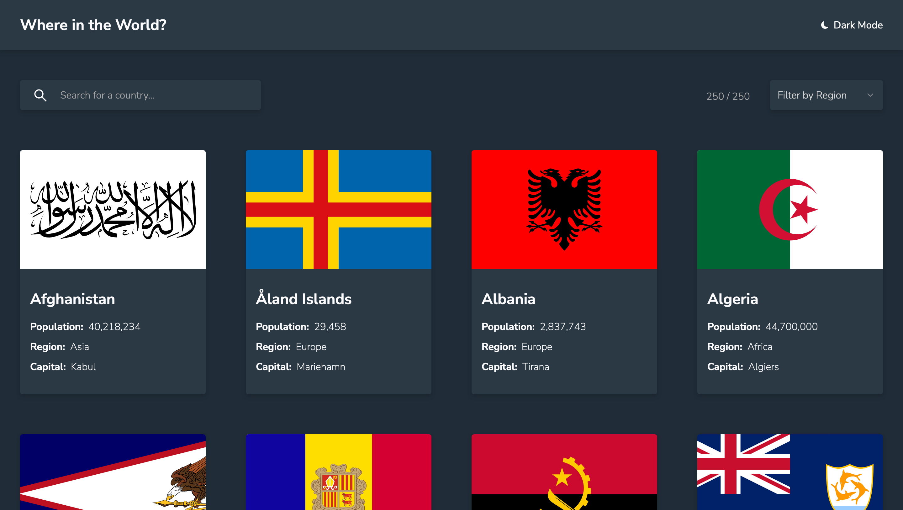
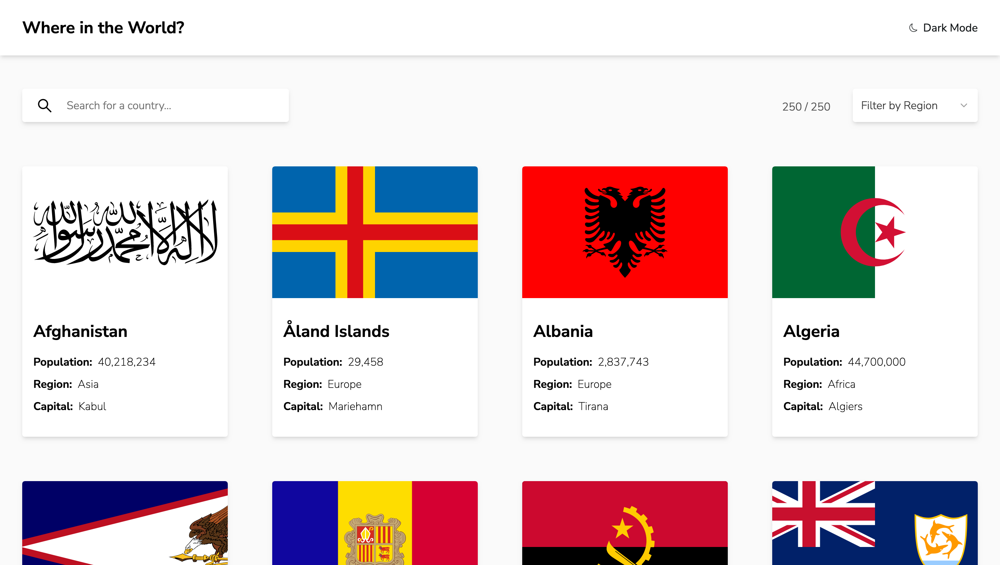
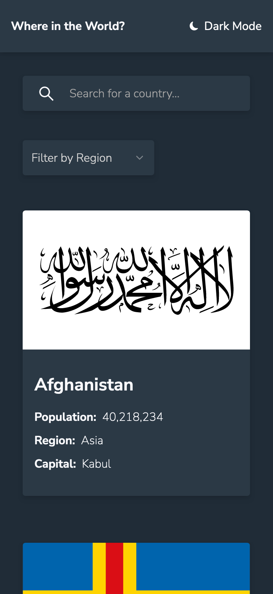
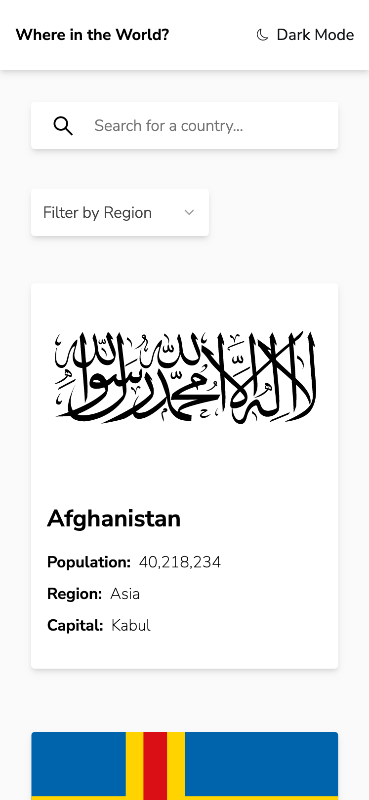

# Where in the World?

This is a solution to the [REST Countries API with color theme switcher challenge on Frontend Mentor](https://www.frontendmentor.io/challenges/rest-countries-api-with-color-theme-switcher-5cacc469fec04111f7b848ca). Frontend Mentor challenges help you improve your coding skills by building realistic projects.

Click [here](https://where-in-the-world-ten-sigma.vercel.app/) to check out the live site.

## Table of contents

- [Overview](#overview)
  - [The challenge](#the-challenge)
  - [Screenshots](#final-screenshots)
  - [Links](#links)
- [My process](#my-process)
  - [Built with](#built-with)
- [Author](#author)
- [Acknowledgments](#acknowledgments)

## Overview

### The challenge

Users should be able to:

- See all countries from the API on the homepage
- Search for a country using an `input` field
- Filter countries by region
- Click on a country to see more detailed information on a separate page
- Click through to the border countries on the detail page
- Toggle the color scheme between light and dark mode

### Final Screenshots

#### Desktop version

#### Mobile version

### Links

- [Check out the code here](https://github.com/brandondykun/where-in-the-world)
- [View the live site here](https://where-in-the-world-ten-sigma.vercel.app/)

## My process

### Built with

- [React](https://reactjs.org/) - JS library
- [Next.js](https://nextjs.org/) - React framework
- [REST Countires API](https://restcountries.com/) - country data
- [shadcn/ui](https://ui.shadcn.com/) - component library
- Tailwind
- CSS Grid
- Flexbox
- Mobile-first workflow

## Author

- Website - [Brandon Dykun](https://brandondykun.com)

## Acknowledgments

Shout out to [Frontend Mentor](https://www.frontendmentor.io/) for providing the guidelines a resources necessary to complete this challenging and educational mini project.
